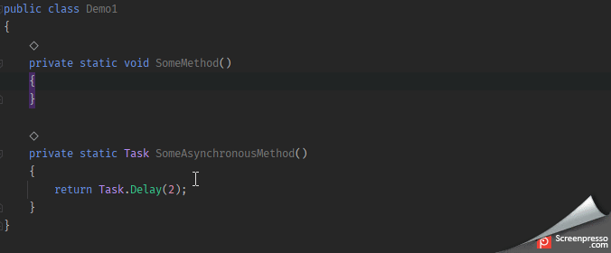

# AsyncApostle

This is an implementation of a ReSharper Plugin that converts your synchronous code to its asynchronous version and helps you to write your own asynchronous applications.

This is a copy of the very useful and popular extension [AsyncConverter](https://github.com/BigBabay/AsyncConverter), which was developed by [Igor Mamay](https://github.com/BigBabay). 

AsyncConverter has not received immediate attention in the past year (2021), making it hard to stay recent with with ReSharper updates as AsyncConverter updates would continually lag behind. So AsyncApostle was created to resolve that.

## Convert Any Method to Its Async Implementation

AsyncApostle can:

1. Replace a returning type with generic or non-generic `Task<T>` or `Task`
2. Rename a hierarchy of overridden methods from _&lt;MethodName&gt;_ to _&lt;MethodName&gt;Async_
3. Add the `System.Threading.Tasks` to a usings declaration
4. Analyze a method body and replace the every synchronous call with its `async` implementation if exists.
5. Analyze a method body and replace the every `.Result` call with the `await` call.
6. Analyze usage of a processed method. If the method is called from `async` context the AsyncApostle will replace its call with the `await` expression, otherwise it will just call `.Result` or `.Wait()`
7. Analyze invocation of a `Task`-returning method. If the `Task` returned from the method is neither awaited nor returned, a warning will be shown.

<details>
    <summary>Converter method to async demo</summary>


</details>

## Highlightings

### Convert `Wait()` and `Result` to `await`

Under `async` method replace `Wait()` and `Result` to `await`.

<details>
    <summary>Replace wait to await demo</summary>


</details>

<details>
    <summary>Replace result to await demo</summary>


</details>

### Return `null` as `Task`

If expected returning type is `Task` or `Task<T>` but null is returned instead, AsyncApostle warn you that execution point can await expected 'Task' and get `NullReferenceException`.

<details>
    <summary>Return null as task demo</summary>

    
</details>

### Async suffix in a method name

AsyncApostle will suggest you to add the `Async` suffix to an asynchronous method name in all cases except:

1. Classes inherited from `Controller` or `ApiController`
2. Methods of test classes. NUnit, XUnit and MsUnit are supported. This may be turn off in _Resharper &rarr; Options &rarr; Code Inspection &rarr; Async Apostle &rarr; Async Suffix_

<details>
    <summary>Suggesting method name with Async suffix demo</summary>


</details>

### Suggesting to configure an every await expression with ConfigureAwait

<details>
    <summary>Suggesting ConfigureAwait demo</summary>


</details>

### Suggesting to use the async method if exists

If a synchronous method is called in the async context and its asynchronous implementation exists (e.g method has same signature `Async` suffix and `Task` or `Task<T>` as the returning type) AsyncApostle will suggest you to use this asynchronous implementation.

Do not suggest to use obsolete async methods.

<details>
    <summary>Suggesting method name with Async suffix demo</summary>


</details>

### Async/await ignoring

An `await` expression can be ignored if this `await` expression is the single in a method and awaited value is returned from a method.

<details>
    <summary>Async/await ignoring demo</summary>


</details>

### Missing await

Analyze invocation of a `Task`-returning method. If the `Task` returned from the method is neither awaited nor returned, a warning will be shown. 

<details>
    <summary>Missing `await` demo</summary>


</details>

## Development

Taken from the [official JetBrains template](https://raw.githubusercontent.com/JetBrains/resharper-rider-plugin).

### Prerequisites

When developing for Rider, [Java 11 Amazon Corretto](https://docs.aws.amazon.com/corretto/latest/corretto-11-ug/downloads-list.html) should be installed.

### Run

For general development, there are a couple of scripts/invocations worth knowing. Most importantly, to run and debug your plugin, invoke:

```
# For Rider
gradlew :runIde

# For ReSharper (VisualStudio)
powershell .\runVisualStudio.ps1
```
